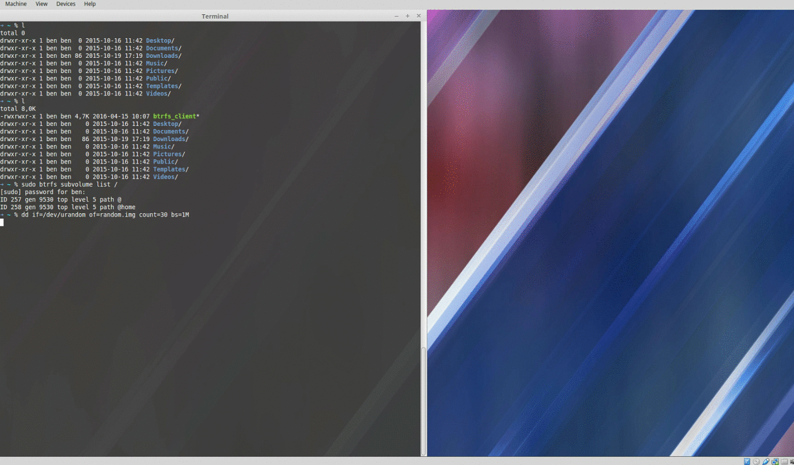

# btrfsBackup

Is a server that uses ssh to remote to a target machine and push down a client script,
the client script then initiates a btrfs snapshot of the target subvolume and sends back the delta while providing progress.
Once the backup has completed the client script removes itself. 

The server manages the snapshots and displays their size, date, and backup duration, 
as well as providing the option to download or remove stored snapshots.

## Installation

setup with `npm install`

run with `node bin/www`

go to http://localhost:3000

## Demo

